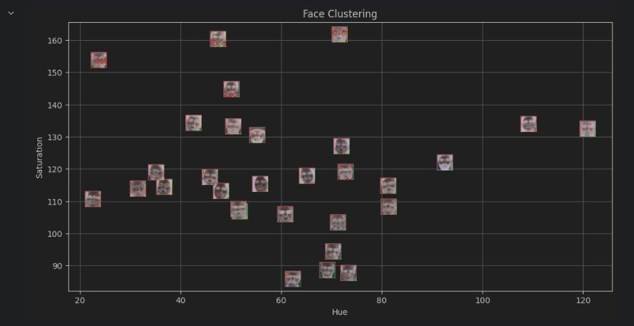
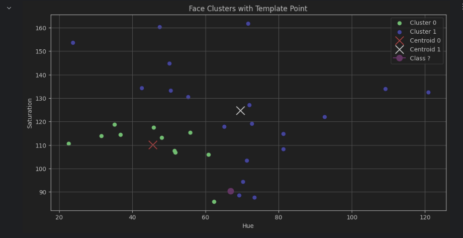
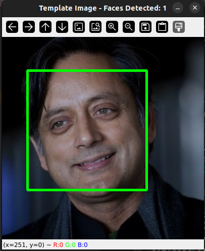
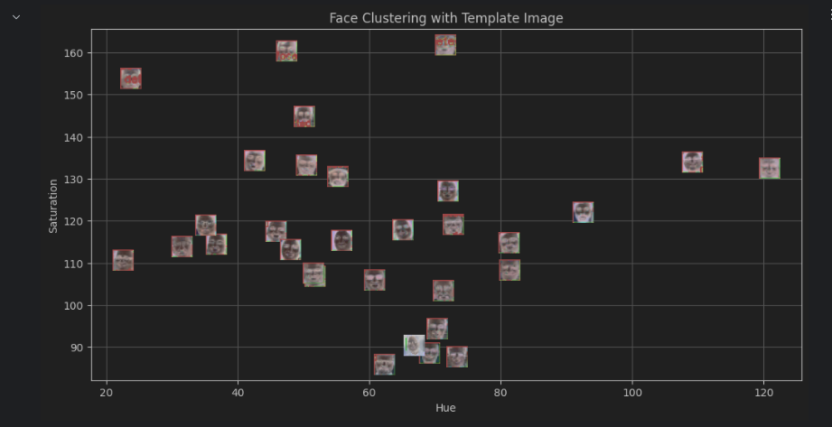

# Report
1.  - Euclidean Distance: Most common metric, calculates straight-line distance between points
    - Manhattan Distance: Sum of absolute differences between coordinates, useful in grid-like spaces
    - Minkowski Distance: Generalization of Euclidean and Manhattan distances
    - Hamming Distance: Counts positions where corresponding elements differ, used for categorical data

2. Real world applications include classifying patients based on symptoms and test results, determining creditworthiness based on financial history and identifying objects or faces in images.
3. - Euclidean Distance: Works well in low-dimensional space, formulae: sqrt(sum((x-y)²))
   - Manhattan Distance: Good for grid-like structures and less sensitive to outliers, formulae: sum(|x-y|)
4. Cross validation helps assess model generalization, prevents overfitting, helps in parameter tuning and provides robust performance estimates.
5. - Variance: higher k is lower variance, measures model's sensitivity to training data, too low k leads to overfitting
   - Bias: higher k is higher bias, represents the model's assumptions, too high k leads to underfitting

# Output

